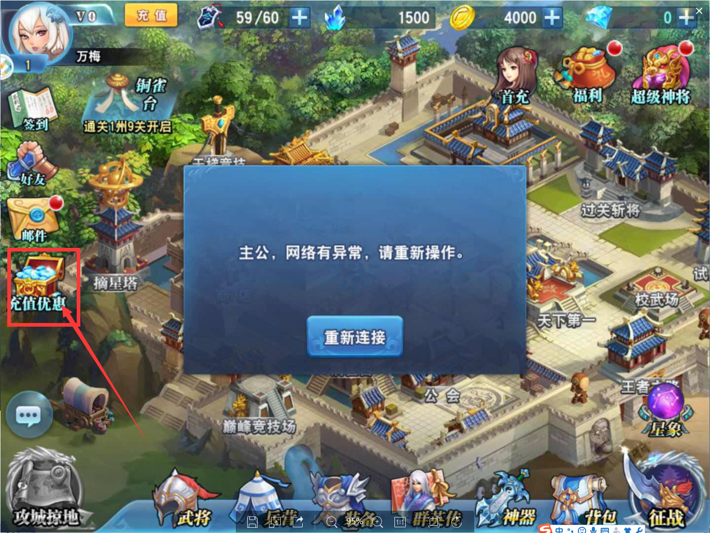

# 天行网页支付 - 接入流程

### 1.游戏界面推荐：

调起支付的入口，分别在游戏主界面增加“充值优惠”浮点图标（位置和图标样式要醒目），商城界面上增加“充值优惠”按钮，点击后都可以跳转到网页充值。 需游戏开发方在苹果提审时通过服务端将主界面的浮点图标和商城内的按钮隐藏，审核通过后开启。

开启: 游戏启动时, 向服务器请求初始信息, 如果收到特定标识(网页支付关闭时不要传相应的配置项, 免得被苹果猜到), 就开启。

### 2.信息商定：

游戏开发方要与我司先商定好接入信息, 我方将在系统上添加相应的公司信息与游戏信息, 由游戏开发方提供接收支付完成回调的 url地址, 我司会提供游戏相应的 gameid(游戏id) 和 authkey(加密密钥)。

系统默认的游戏金额列表为 6,30,98,198,328,648 , 如果游戏金额列表不是如上列表, 游戏方可提供给我司进行配置。

### 3.跳转到网页支付：

打开一个 webview 跳转到 网页支付;

get 或者 post 方式传递参数(参数格式参照接口文档)均可, 推荐用 post 方式;

页面支付会让玩家选择要充值的金额和数量, 然后会打开网银支付;

玩家支付完成后, 系统会以 post 方式通知游戏方完成信息, 信息包括 玩家名、游戏服务器id、支付金额、充值金额项及数量、签名 等;

游戏方要对信息进行 签名验证; 然后根据充值金额项与数量给玩家发放游戏币。

### 4.支付完成后返回游戏：

游戏方的 webview 需要提供 名为 TxWebView 的 JS 对象, 并提供 TxWebView.closeWindow() 用于关闭 webview, 建议同时刷新玩家信息;

网页支付系统将在玩家完成支付后在网页上用JS调用 TxWebView.closeWindow()。

### Other.杂项：

系统提供了订单二次验证的接口, 游戏方提供 订单号、服务器id、玩家名、支付金额，接口会返回查询结果，如果信息正确并且订单已经完成支付，会返回成功信息，否则返回失败信息。

系统会在24小时内对同一笔订单的完成信息，进行多次通知, 游戏方必须对数据去重, 避免重复给玩家发放游戏币造成损失。
