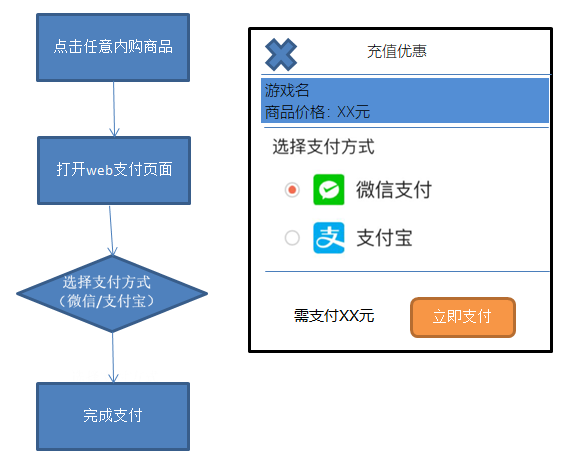
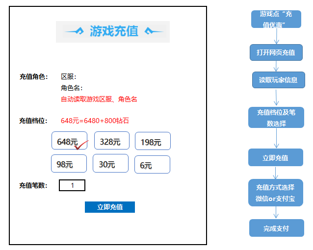

# 天行网页支付 - 接入流程

### 1.应用场景：

<strong>应用场景一（推荐）：</strong>用户打开游戏内商店，点击内购之后弹出对应金额的充值页面（webview），在页面完成充值后关闭页面，游戏内对应代币（钻石、元宝等）到账。
注意点：游戏服务端需要配置开启关闭功能，苹果提审时将web支付关闭切换回苹果支付，过审之后再打开（届时我方会提醒何时关闭）。

<strong>应用场景二：</strong>在游戏主界面增加“充值优惠”浮点图标（位置和图标样式要醒目），商城界面上增加“充值优惠”按钮，点击后都可以跳转到网页充值。 
注意点：游戏服务端需要配置开启关闭功能，苹果提审时将“充值优惠”浮点图标和按钮隐藏起来，过审之后再打开（届时我方会提醒何时关闭）。

<strong>游戏内参考展示</strong>：

### 2.信息商定：

游戏开发方要与我司先商定好接入信息, 我方将在系统上添加相应的公司信息与游戏信息, 由游戏开发方提供接收支付完成回调的 url地址, 我司会提供游戏相应的 gameid(游戏id) 和 authkey(加密密钥)。

系统默认的游戏金额列表为 6,30,98,198,328,648 , 如果游戏金额列表不是如上列表, 游戏方可提供给我司进行配置。

### 3.跳转到网页支付：

打开一个 webview 跳转到 网页支付;

get 或者 post 方式传递参数(参数格式参照接口文档)均可, 推荐用 post 方式;

页面支付会让玩家选择要充值的金额和数量, 然后会打开网银支付;

玩家支付完成后, 系统会以 post 方式通知游戏方完成信息, 信息包括 玩家名、游戏服务器id、支付金额、充值金额项及数量、签名 等;

游戏方要对信息进行 签名验证; 然后根据充值金额项与数量给玩家发放游戏币。

### 4.支付完成后返回游戏：

游戏方的 webview 需要提供 名为 TxWebView 的 JS 对象, 并提供 TxWebView.closeWindow() 用于关闭 webview, 建议同时刷新玩家信息;

网页支付系统将在玩家完成支付后在网页上用JS调用 TxWebView.closeWindow()。

### Other.杂项：

系统提供了订单二次验证的接口, 游戏方提供 订单号、服务器id、玩家名、支付金额，接口会返回查询结果，如果信息正确并且订单已经完成支付，会返回成功信息，否则返回失败信息。

系统会在24小时内对同一笔订单的完成信息，进行多次通知, 游戏方必须对数据去重, 避免重复给玩家发放游戏币造成损失。
